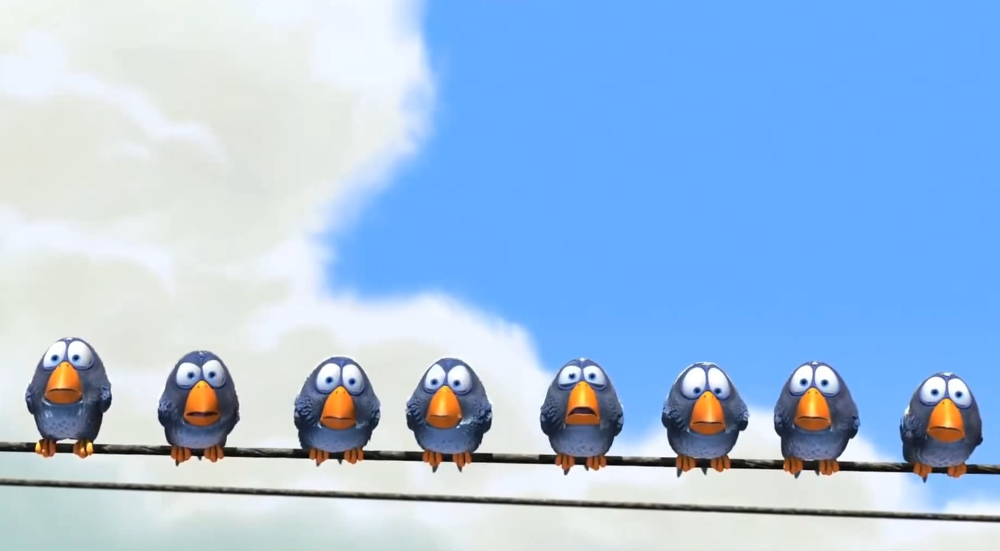

# Problem H: Birds Rituals

Birds are stupendous animals. Many species of them perform different rituals throughout their life; from courtship dances of peacocks to moonwalking of red-capped manakins. Among all we are studying the _permutation dance_ in this problem. This ritual is performed by a group of birds siting in a row on a wire or tree branch, as shown in the figure.

The ritual can be simplified to a performance based on a sequence of actions of these types:

- insertion: A new bird joins the group and inserts herself somewhere in the row of the birds.  

- departure: A bird in the row leaves the group for rest of the ritual and flies away.  

- relocation: A bird in the row flies from her position and sits (inserts herself) somewhere else in the row.

Given the initial position of the birds in the row and the sequence of actions, your task is to compute the final position of the birds in the ritual.

## Input

The input starts with a line containing two space-separated integers $n$ ($1 \le n \le 1000$) and $s$ ($1 \le s \le 5000$). The second line contains $n$ space-separated bird names, as the initial configuration of the ritual (positioning of the birds in the row, from left to right). Each bird name is a non-empty string of at most 10 (lowercase) alphanumeric characters (`a` to `z`, and `0` to `9`).

The sequence of actions is provided in the next $s$ lines, one action per line. Each line is in one of the following formats based on the action type. The `bird-name` parameter in the actions has the similar format as the second line of the input.

- insertion: `insert bird-name position`

The `position` parameter is an integer showing the number of birds to the left of the insertion position. This parameter is in the range $[0, M]$ where $M$ is the total number of birds in the row before the insertion. Position 0 puts the bird in the beginning (leftmost position) of the row, and position $M$ puts the bird in the end (rightmost position).

- departure: `depart bird-name`

- relocation: `relocate bird-name displacement`

The `displacement` parameter is an integer that can be positive, negative, or zero. The bird flies to her own position if the displacement is 0. Otherwise, the bird flies over $k$ birds on his right (left) if displacement is positive (negative), where $k$ is the absolute value of displacement. This parameter is in the range $[-L, +R]$ where $L$ and $R$ are respectively the numbers of birds to the left and to the right of the moving bird in the row before the relocation. Displacement $-L$ puts the bird in the beginning (leftmost position) of the row, and displacement $+R$ puts the bird in the end (rightmost position).

No two participating birds share the same name. Moreover, it is guaranteed that all the actions are meaningful at the moment of execution and there is always at least one bird on the branch throughout the ritual.

## Output

Print a single line in the output containing the final configuration of the ritual. The line should contain the space-separated list of the bird names in the row (from left to the right).
