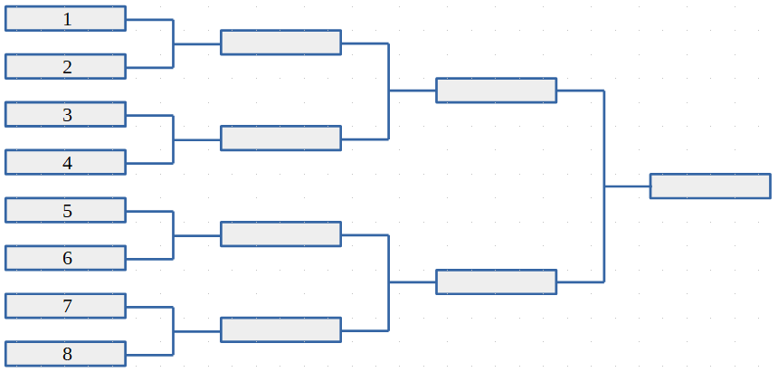

# Problem K : Iranian Hazfi Cup

The Iranian Hazfi Cup is a football tournament organized every year in a knockout format; i.e. the loser of each match is immediately eliminated from the tournament, and the winner gets to play in the next round. Every year, $2 ^ k$ teams participate in this tournament (for some positive integer $k$). All teams start the tournament in the first round and after each round, half of the teams that are still in the tournament are eliminated. The $k$ -th round is the final round, where two teams compete for the championship. In total, $2 ^ k - 1$ matches are held.

The _tournament bracket_ of the Hazfi Cup is determined ahead of time in the drawing ceremony in the presence of special guests. It determines which teams are facing each other in the first round, and which other teams they might encounter if they advance to the next rounds. Precisely, in the drawing ceremony, all $2 ^ k$ teams are randomly mapped to the positions $1, 2, \dots, 2 ^ k$ in the first round as depicted in the figure for $k = 3$

The Iranian football federation must start organizing the Hazfi Cup 2O23. As many of the special guests might refuse to attend the drawing ceremony this year, the federation has decided to use the same tournament bracket as Hazfi Cup 2022. Unfortunately, last year's tournament bracket is not available, but all match results of last year's tournament are available in an arbitrary order. It can be shown that the tournament bracket can be uniquely determined from these match results. Your task is to recover the tournament bracket from the match results of Hazfi Cup 2022 in order to answer the following fans' common questions for this year:

-   In which round two teams, A and B, may face each other?

## Input

The input starts with a line containing two space-separated integers $k$, the number of rounds in the tournament ($1 \le k \le 10$), and $n$, the number of fans' questions ($1 \le n \le 1000$). The match results of the Hazfi Cup 2022 come in the next $2 ^ k - 1$ lines; one line for each result. Each match result is of the form:

-   $teamA \; g_A - g_B \; teamB$

where $teamA$ and $teamB$ are different non-empty strings of lowercase English letters of length at most 100, and $g_A$ and $g_B$ denote the number of goals scored by $teamA$ and $teamB$, respectively ($g_A \neq g_B$). In the case of a draw, the winner is determined by penalty shootouts, and the match result is of the form:

-   $teamA \; g(p_A) - g(p_B) \; teamB$

where $g$ is the number of goals scored by each team during the main game, and $p_A$ and $p_B$ are the number of goals scored by $teamA$ and $teamB$ during the penalty shootouts, respectively ($p_A \neq p_B$). The number of scored goals (i. e. $g_A, g_B, g, p_A$, and $p_B$) are all non-negative integers less than 100. Note that each line denoting a match result in the input contains exactly 4 space characters.

The input ends with $n$ queries. Each query is given in a separate line containing two different team names delimited by a space character.

## Output

For each query in the input, print as the answer, a single integer in a separate line in the output.
