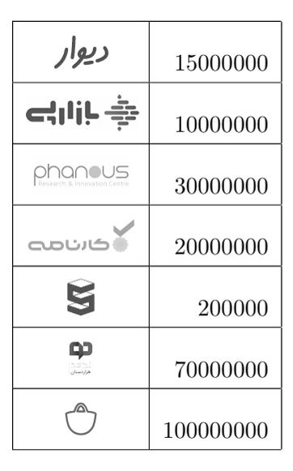

# Problem J: Cafebazaar's Applications

It's the end of the year, and Cafebazaar has released a list, containing the number of users of each of its $n$ applications. Now, each application is eager to showcase its success through an advertisement image, which highlights a continuous subset of the application list containing the application itself. Also, for the image to be credible, it should contain at least $k$ applications, including itself.

For each application in this list, we need to determine the minimum possible rank this application can achieve within any valid subset, according to the number of users. The rank of an application within a subset is defined by the number of applications in that subset that have more users than it, plus one.

## Input

The first line of input consists of two integers $n$ and $k$ $1 \le k \le n \le 10 ^ 5$) where $n$ represents the total number of applications and $k$ represents the minimum number of applications in an advertisement image. The following $n$ lines contain information about each application: the $i ^ {th}$ line contain $c_i$, representing the number of users for the $i ^ {th}$ application ($1 \le c_i \le 10 ^ 8$).

## Output

In the only line of output print $n$ space-separated integers. The $i ^ {th}$ integer should be the minimum :ank that $i ^ {th}$ application can achieve within an advertisement image.
