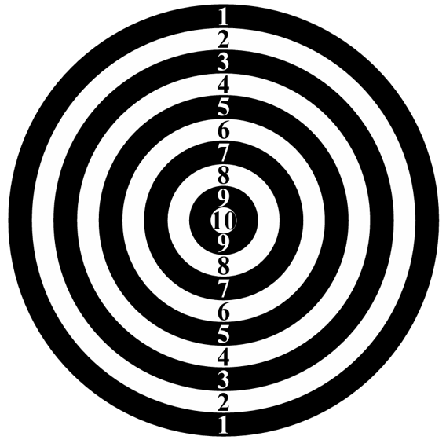

# Problem B : Chaarshanbegaan at Cafebazaar

Charshanbegan is a gathering event at Cafebazaar similar to TGIF events at Google. Some entertainment programs like pantomime, foosball, Xbox/PS4, and several board games are part of the event. You are going to set up a dart game in Charshanbegan. As a techie organizing a game for techies, you would rather use a smart screen and write a program to calculate the scores instead of hanging a traditional dartboard and scoring the shots manually. Your program must get the coordinates of dart shots for a player and calculate his/her total score. The score for each dart shot at point ($x , y$) is calculated based on its distance from the center of the dartboard (point ($0, 0$). If the distance is $d$ millimeters, the score is calculated based on the following table:

| Condition         | Score |
| :---------------- | :---- |
| $d \le 10$        | $10$  |
| $10 < d \le 30$   | $9$   |
| $30 < d \le 50$   | $8$   |
| $50 < d \le 70$   | $7$   |
| $70 < d \le 90$   | $6$   |
| $90 < d \le 110$  | $5$   |
| $110 < d \le 130$ | $4$   |
| $130 < d \le 150$ | $3$   |
| $150 < d \le 170$ | $2$   |
| $170 < d \le 190$ | $1$   |
| $190 < d$         | $0$   |

## Input

The first line of the input contains a single integer $N$ as the number of dart shots for a player ($1 \le N \le 100$). Each of the next $N$ lines contains two space-separated integers as the coordinates ($x$, $y$) of a dart shot. The coordinates are in millimeters and their absolute values will not be greater than 300.

## Output

Print a single line containing the total score of the player.
