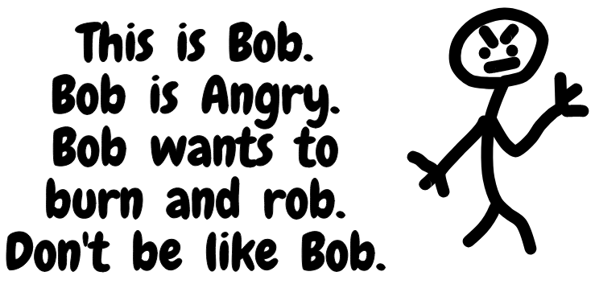
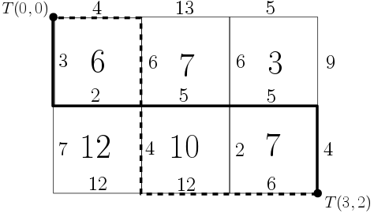

# Problem F: Lets Burn and Rob Manhootan

There are two types of angry people in this world, those who burn and those who rob. But we programmers know that there is a third type; those who counter their anger, by both burning and robbing.

Bob lives in Manhootan. The city of Manhootan is like a grid of $n$ rows and $m$ columns, containing $n \times m$ blocks. The rows are numbered from 0 to $n - 1$ from north to south and the columns are numbered from 0 to $m - 1$ from west to east. The $j$-th block on $i$-th row is worth $A_{ij}$. Before the first row, between every two consecutive rows, and after the last row, there is a west-east street. The $n + 1$ west-east streets are numbered from 0 to $n$ from north to south. Similarly, before the first column, between every two consecutive columns, and after the last column, there is a north-south street. The $m + 1$ north-south streets are numbered from 0 to $m$ from west to east. The part of a street that is between two adjacent blocks is called a _street segment_. Each west-east street contains $m$ street segments, numbered from 0 to $m - 1$ from west to east. Similarly, each north-south street contains $n$ street segments, numbered from 0 to $n - 1$ from north to south. Since Manhootan is an expensive city, passing through street segments costs money. Passing through the $j$-th segment of the $i$-th west-east street costs $H_{ij}$ and passing through the $j$-th segment of the $i$-th north-south street costs $V_{ij}$.

After a recent crisis in Manhootan, Bob got angry. He pierced his car's fuel tank to make it leak on the streets he passes. Let's call the intersection of $i$-th west-east street and $j$-th north-south street, $T(i, j$). At first, Bob is at $T(0, 0$). He is planning to drive to $T(n, m$) only going east and south, then returning to $T(0, 0$) only going west and north. Then, he is going to light the leaked fuels and put the streets on fire. After that, Bob will rob all the blocks that are caught inside the fire, i.e., any block that can not reach outside of Manhootan without crossing a burning street, will be robbed by Bob. The figure shows one possible plan for Rob in the sample.

Now, you can't be like Bob, but you can help him find the most profitable burn-and-rob plan. In other words, maximize the total value of the robbed blocks minus the total cost of the passed street segments. A street segment may be passed twice, which should be paid for each separately.

## Input

The first line of input contains two integers $n$ and $m$ ($1 \le n, m \le 200$), the number of rows and columns, respectively. The next $n$ lines describe the value of blocks; each containing $m$ numbers, where the $j$-th number of the $i$-th line denotes $A_{ij}$ ($1 \le A_{ij} \le 100$). The next $n + 1$ lines describe the cost of west-east street segments. Each line contain $m$ numbers, where the $j$-th number of the $i$-th line denotes $H_{ij}$ ($1 \le H_{ij} \le 1000$). Finally, the next $m + 1$ lines describe the cost of north-south street segments. Each line contains $n$ numbers, where the $j$-th number of the $i$-th line denotes $V_{ij}$ ($1 \le V_{ij} \le 1000$).

## Output

Print the profit of the most profitable plan. Note that the answer can be negative, zero, or positive.
