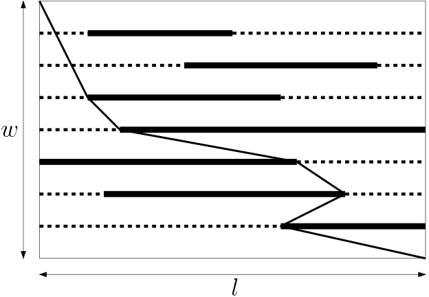

# Problem G : Gift Puzzle

Peyman's birthday party is being held. Keivan, his old friend, has bought a puzzle as a birthday gift. The puzzle consists of a flat rectangular board with a length of $l$ and a width of $w$, and a thread. The board has $n$ horizontal rails of length $l$ placed at different distances from the top horizontal side. On each rail, there is one obstacle which can _slide freely_ on the rail. An example of the board is depicted in the figure. The rails are illustrated by dotted lines, and the obstacles are illustrated by thick segments.

In order to solve the puzzle, one must connect the top-left corner of the board to the bottom-right corner using the supplied thread. The thread must be inside the board and cannot pass through obstacles. In the figure, one possible way to do the puzzle is shown. Since Keivan believes in Peyman's ability to solve hard puzzles, he wants to give Peyman the shortest thread while it is still possible to connect the two corners. So, kindly help Keivan to find the desired length of the thread.

## Input

The first line of the input contains three integers $l$, $w$ ($2 \le l, w \le 10 ^ 9$), the length and the width of the board, and $n$ ($1 \le n \le min(100000, w - 1)$), the number of the rails. Each of the next $n$ lines contains two integers $y_i$ ($1 \le y_i \le w - 1$), indicating the distance between the $i$-th rail and the top horizontal side, and $l_i$ ($1 \le l_i \le l - 1$), length of the obstacle on the $i$-th rail. Note that all $y_i$'s are distinct. You may assume that all obstacles and the thread have a width of zero.

## Output

In the only line of the output, print the minimum $t$ for which it is possible to configure obstacles such that the top-left corner can be connected to the bottom-left corner using a thread of length $t$ while avoiding obstacles. Your answer is considered to be correct if it has a relative error of at most $10 ^ {-9}$.
