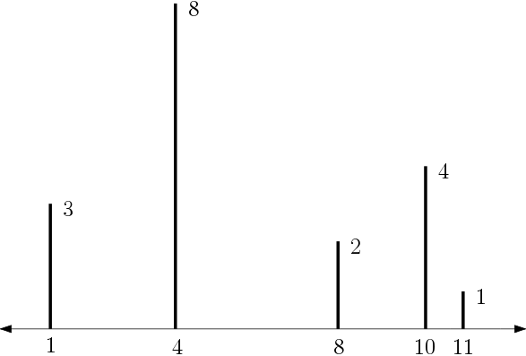

# Problem J : Greedy Termite

There are $n$ wooden rods vertically placed over a horizontal line. The rods are numbered 1 through $n$ from left to right. Each rod $i$ ($1 \le i \le n$) is placed at position $x_i$ and has a height $h_i$.

A termite wants to eat all the rods one by one. It starts eating from an arbitrary rod $s$ ($ 1 \le s \le n$). Then, after eating a rod $i$, the termite selects the next rod to eat based on the following method. Among the remaining rods $j$, the one with maximum $h_j - | x_i - x_j |$ is selected. If there are ties, the one with minimum $| x_i - x_j |$ is selected. If there are still ties, the left-most rod is selected.

Your task is to calculate the total (horizontal) distance traveled by the termite to eat all the rods.

## Input

The first line of the input contains two space-separated integers $n$, the number of rods, and $s$, the starting rod number ($1 \le s \le n \le 100000$). The rods are described in the next $n$ lines. On the line $1 + i$ ($1 \le i \le n$), the $i$-th rod is specified with two space-separated integers $x_i$ ($| x_i | \le 10 ^ 9$) and $h_i$ ($1 \le h_i \le 10 ^ 9$). Additionally, for each $i$ ($1 \le i \le n - 1$), $x_i < x_{i + 1}$.

## Output

You should print a single integer denoting the total distance traveled by the termite.
