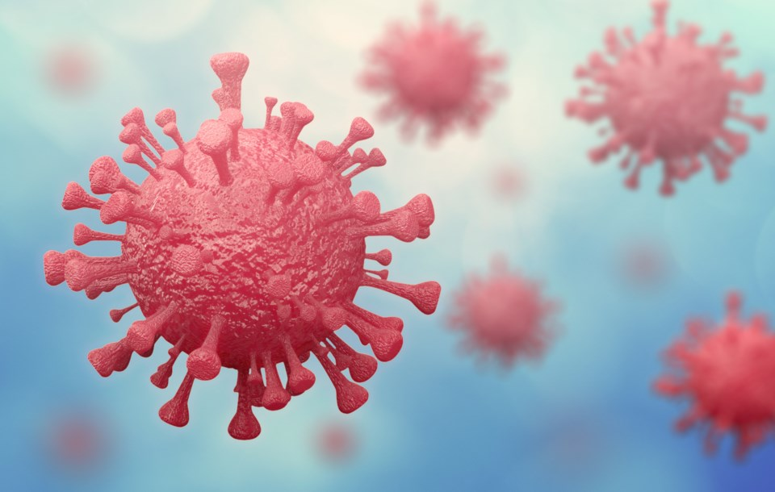

# Problem A: Covid-19

The ministry of health in Neverland has recently published a colorcoded chart to help people better understand the level of Covid-19 risk in different cities, and take appropriate actions and precautions based on the risk level.

In this chart, each city is colored either red, yellow, or white, based on some indicators showing the coronavirus risk level at that city. After exploring several models, the ministry has reached the following criteria for classifying the cities. For a given city, if the average number of new cases per day over the past two weeks is at most 50 per one million population, and the average number of new hospitalizations per day over the past two weeks is at most 10 in every one million population, then the city is marked as white, meaning that the city is in a low-risk zone. On the other hand, if the average number of new hospitalizations per day in a city over the past two weeks is more than 30 per one million population, then the city is categorized as high-risk and is color-coded red. All other cities are colored yellow.

While the data for new cases and hospitalizations are publicly available, the ministry does not update its colorcoded chart very frequently. Hana, a curious student, likes to know the risk level of her city at any point of time, before the ministry publishes its updated chart. She can obtain the average number of new cases and new hospitalizations from the Internet, but she needs your help to convert this data to a colorcode that better demonstrates the risk level at her city.

## Input

The input consists of two lines. The first line contains an integer $p$ ($0 \le p \le 1000$), showing the average number of new cases per day in every one million population in Hana's city over the past two weeks. The second line contains an integer $q$ ($0 \le q \le 500$), showing the average number of new hospitalizations per day in every one million population over the past two weeks in that city. Note that $q \le p$.

## Output

In the output, print the color-code of Hana's city. It must be either `White`, `Yellow`, or `Red`.
