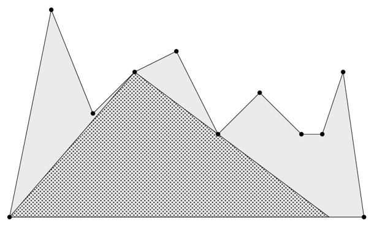

# Problem E: Largest Triangle

A "terrain" is an $x$-monotone polygon defined by the points $p_1, \dots, p_n$ where each point $p_i$ has coordinates ($x_i, y_i$), and the following three conditions hold:

-   $y_1 = y_n = 0$
-   $y_i > 0$ for $1 < i < n$
-   $x_i < x_{i + 1}$ for $1\le i < n$

Given a terrain defined by the points $p_1, \dots, p_n$, find the largest triangle that fits entirely within the terrain, and one of its three vertices is positioned at one of the terrain points $p_2$ through $p_{n - 1}$.

## Input

The first line of input contains an integer $n$, representing the number of points in the terrain ($3 \le n \le 10 ^ 5$). The $i ^ {th}$ line in the following $n$ lines consists of two space-separated integers $x_i$ and $y_i}$, representing the point $p_i$ of the terrain ($0 \le x_i, y_i \le 10 ^ 9$).

## Output

Print the area of the largest triangle contained within the terrain. Your output will be considered correct if its absolute or relative error is at most $10 ^ {-6}$.
