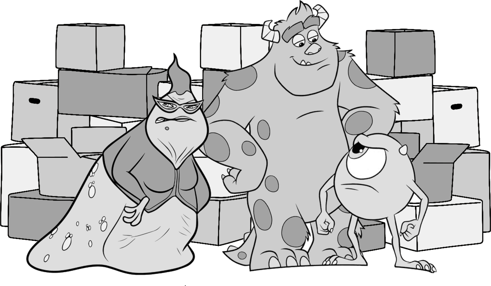

# Problem K : Monster Warehouse

Mike and Sally work in the warehouse of Monster Inc. as storekeepers. Their daily tasks are to process incoming requests and update the inventory of the Warehouse. Requests only include buying, selling, unpacking, and packing containers. The warehouse includes goods and containers and has unlimited space. A container may contain goods or other containers as sub-containers.



The exact format of the requests is given below.

-   `BUY <CONTAINER_DESCRIPTION>`
-   `SELL <CONTAINER_ID>`
-   `UNPACK <CONTAINER_ID>`
-   `PACK <CONTAINER_DESCRIPTION>`

Each container which is not inside any other container is uniquely identified by a positive integer ID. Assigning IDs to containers is done sequentially and started from 1. An ID is valid if and only if its container exists in the warehouse, otherwise it is invalid.

A container description is enclosed in parentheses and lists the contents, which can be either goods or sub-containers. A good is identified exclusively by its name, which consists of non-case-sensitive English letters. Multiple units ofa good may be available. To denote quantities, place a positive integer 'N' before or after the good name (separated by one whitespace), where $N < 100$ is the number of the good. For example, `((tomato, potato), 4 celery, (wood, (silk 3, banana 2)))` describes a container with four units of celery and two sub-containers.

The description of each request is as follows:

-   `BUY`: A new container is transferred into the warehouse and an ID is assigned to it.

-   `SELL`: An existing container with the given ID is ship out and its ID becomes invalid.

-   `UNPACK`: All goods and sub-containers are extracted from the container and added to the warehouse. Moreover, the sub-containers become new containers and get their own ID. The assignment of IDs to the new containers is based on the order of their appearance in the container description (from left to right). For instance, considering the following two lines as the first requests, results in adding one unit of celery and adding three containers with IDs 2, 3, and 4 to the warehouse and ID 1 becomes invalid.

    ```
    BUY (celery, (Banana) , (Celery) , (celery))
    UNPACK 1
    ```

-   PACK: Goods specified in a `PACK` request are grouped into a new container, which is then assigned the next available ID.

Mike and Sulley process the requests in the order they are received. Any request with an invalid container ID must be discarded. Moreover, for `PACK` request they need to check if there exists enough units of each good in the warehouse.

Roz, the agent of Monster Inc. has told Mike once "I'm watching you, Wazowski. Always watching. Always.", She rolled her desk into their office and asked for requests and reports. She is looking for every detail. She is reviewing each request and might ask a few questions. Her questions might be each of the following types:

-   `? COUNT <good>`: How many units of the given good exist outside of containers?
-   `? CONTAINS <good>`: How many containers with ID have the given good,i.e. the good is in the container or there is a recursive sub-container which contains that good.
-   `? MIN <good>:` At least how many containers should be unpacked to reach one unit of the good. If it is impossible, the answer should be `-1`.

Mike and Sully are expected to answer these queries using just one integer.

Before helping Mike and Sully, read samples carefully.

## Input

The input consists of $n$ requests or queries from Roz while she is reviewing ($1 \le n \le 5000$);each appears in a separated line. The name of each good is limited to 100 characters. Each container description might have at most 5000 characters and the input size is less than $10 ^ 6$ characters.

## Output

Each line of the report is associated with a request or Roz's questions. After each `BUY`, `SELL`, `PACK`, `UNPACK` request, you should print `OK`, if the request is not discarded. Otherwise, print DISCARD. If the request is UNPACK, after printing OK, you should print the number of containers added to the warehouse (read samples for more details). For each Roz's query, print just one integer in a line.
