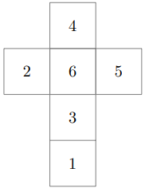

# Problem L : Rolling-Dice Puzzle

Sarina and her brother, Soroush, are playing the rolling-dice game. The game is played on an $n \times m$ board. Initially, Soroush places a standard dice in one of the cells. It is place in a way that the number 6 is on the upper face, the number 4 is on the north face, and the number 2 is on the west face. In a standard dice, 6 is on the opposite side of 1, 2 is on the opposite side of 5, and 3 is on the opposite side of 4. Additionally, he selects some of the cells and writes arbitrary integers numbers from 1 to 6 in them.

After that, Sarina have to move the dice on the board by rolling it multiple times. The act of rolling is defined as follows: Suppose two adjacent cells $A$ and $B$ share an edge $e$ and the dice is on the cell $A$; The dice can be rolled around its edge incident to $e$ and moved from $A$ to $B$. For example, consider the starting position of the dice. If the dice is rolled around the ast, west, north, and south edges, the number appearing on the top face after rolling will be 2, 5, 3, ind 4, respectively.

Whenever Sarina moves the dice to a a cell with a number in it in such a way that the number on the upper face of the dice matches the number in that cell, she gets a point. Note that Sarina can get a point from each cell at most one. The game is not that simple! There are obstacles in some of the cell and it is not possible to move the dice to the cells with an obstacle in it. Your task is to find out the maximum points that Sarina can get.

## Input

The first line of input contains two integers $n$ and $m$ ($1 \le n, m \le 100$), indicating the number of rows and columns of the board, respectively. Each of the next $n$ lines contain $m$ characters, describing the board. Empty cells are represented by "." and obstacles are represented by "x". The starting position of the dice is represented by "s" and the selected cells are represented by the integers written in them (from 1 to 6). It is guaranteed that there is only one "s" in the input.

## Output

Output a line containing the maximum points Sarina can get.
